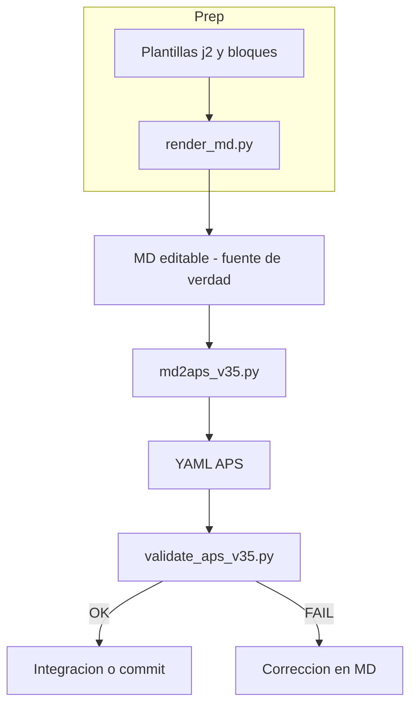

# Metodología SWARM Flexible y Genérica
## Aplicación práctica en el marco DAI / J2C

Esta guía explica cómo evolucionamos desde la edición libre de prompts hasta un modelo controlado, trazable y escalable basado en validaciones automáticas (APS v3.5).
## 2.1 El gap entre edición y validación: cómo se resuelven los problemas ocultos

Por ejemplo: si una IA añade una línea que contradice otra (‘muestra el STATE_JSON’ y ‘no muestres el STATE_JSON’), el validador lo detecta antes del commit.

---

## 1. Contexto general

Desde los primeros desarrollos del SWARM J2C para el proyecto DAI de arquitectura, establecí que cada agente debía contar con un **fichero `.md` como artefacto central de diseño y control**. El formato Markdown se eligió por sus propiedades prácticas: legibilidad, mantenibilidad y trazabilidad.

Cada `.md` contiene el *system prompt* del agente, estructurado por secciones diferenciadas (rol, objetivos, restricciones, protocolos, heurísticas, etc.). Esto permite que tanto humanos como modelos de IA trabajen sobre un formato único, accesible y claro.

El `.md` actúa como **fuente de verdad** del agente. En él se define su comportamiento lógico, su interacción con el orquestador y su función dentro del SWARM. APS v3.5 no sustituye el `.md`, sino que **lo protege mediante validaciones automáticas**, asegurando que las ediciones (humanas o automáticas) no rompan la coherencia estructural.

---

## 2. Problema operativo del enfoque inicial

Con el crecimiento del SWARM, la edición directa de los `.md` por parte de Copilot, ChatGPT u otras IA generaba problemas recurrentes:
- Duplicados: bloques o instrucciones repetidas.
- Contradicciones: órdenes opuestas dentro del mismo prompt.
- Desplazamientos: constraints o heurísticas fuera de su bloque correspondiente.
- Errores de control: edición parcial del STATE_JSON o cambios de roles entre agentes.


La revisión manual de estos documentos era lenta y propensa a errores. Cada modificación podía provocar un **drift semántico** entre agentes, afectando la ejecución del SWARM completo.

---

## 2.1 El gap entre edición y validación: cómo se resuelven los problemas ocultos

Cuando el usuario (o una IA generativa) modifica el `.md` de un agente, los problemas semánticos y estructurales (contradicciones, duplicados, incoherencias) no siempre son evidentes en el propio archivo. La IA puede añadir, mover o eliminar bloques sin tener una visión global del sistema, y el usuario puede no detectar errores manualmente.

Este "gap" se resuelve en la metodología APS v3.5 mediante la conversión automática del `.md` a YAML y la validación estructural y semántica:

1. El usuario/IA edita el `.md` libremente.
2. Al convertir el `.md` a YAML APS, los scripts de validación analizan la estructura, los SIDs, las constraints y las políticas.
3. Si existen problemas ocultos (duplicados, contradicciones, errores de control), los validadores los detectan y bloquean la integración.
4. El usuario recibe feedback inmediato y puede corregir el `.md` antes de que el cambio afecte al SWARM en producción.

Así, la metodología garantiza que cualquier modificación, por creativa o automática que sea, pase por un control técnico antes de ser aceptada, cerrando el ciclo entre edición y validación.

---

## 3. AS-IS → TO-BE: evolución del modelo

APS v3.5 no reemplaza la metodología anterior; la refuerza. El `.md` sigue siendo el núcleo operativo, pero ahora está acompañado de un conjunto de validaciones y estructuras externas que garantizan **consistencia y verificación previa**.

| Aspecto | AS-IS (anterior) | TO-BE (APS v3.5) |
|-----------------------------|------------------|------------------|
| Fuente de verdad            | `.md` editable por IA/humano | `.md` estructurado y validado por SIDs |
| Validación                  | Manual, a posteriori | Automática, previa a commit |
| Reglas                      | Incrustadas en el código | Declarativas en YAML (rulepacks) |
| Escalabilidad               | Limitada a un SWARM concreto | Multi-SWARM, basada en perfiles |
| Control de errores          | Dependiente de revisión humana | Determinista, controlado por scripts |
| Rol del `.md`               | Documento editable | Artefacto validado y auditable |
| Responsabilidad de control  | Manual (usuario) | Automática (scripts APS) |

El resultado es un modelo **MD-first con control semántico**: los agentes se siguen diseñando y redactando en lenguaje natural, pero bajo una estructura auditable y verificable.

---

## 4. Resumen técnico

La metodología APS v3.5 proporciona un marco **modular y auditable** para trabajar con agentes SWARM. Permite mantener la flexibilidad del `.md`, asegurando a la vez que cada documento cumpla las reglas estructurales y semánticas definidas por el sistema.

Los validadores APS detectan duplicados, contradicciones, errores de formato o de política antes de integrar los cambios. De este modo se mantiene un equilibrio entre **creatividad, control y trazabilidad**.

---

## 5. Metodología Flexible y MD-first

El flujo sigue girando alrededor del `.md`. Las estructuras auxiliares —YAML, rulepacks y esquemas— sirven para definir reglas, políticas y verificaciones automáticas. De esta forma, se separa la **expresión del conocimiento** (en `.md`) del **control de su integridad** (en YAML).

### Objetivos clave
- Mantener el `.md` como formato central de trabajo.
- Verificar su coherencia mediante validadores APS.
- Asegurar independencia entre contenido, reglas y código.
- Escalar sin reescribir scripts, solo ajustando perfiles.

---


## 6. Arquitectura Modular

El repositorio se organiza en carpetas estándar que separan la definición de reglas (schemas) de las plantillas y scripts de verificación.

```
/schemas/
  aps_v35.schema.yaml
  rulepacks/
    base.yaml
    input.yaml
    doc.yaml
    qs.yaml

/templates/
  agents/
    base_agent.j2
    input_agent.j2
  blocks/

/profiles/<swarm>/
  agents_map.yaml
  policies.yaml
  sid_patterns.yaml
  sid_registry.yaml

/scripts/
  render_md.py
  md2aps_v35.py
  validate_aps_v35.py
  sids_check.py
  check_yaml_sync.py
  md_patch_apply.py
```

---

## 7. Flujo operativo



### Etapas
1. Renderizado inicial de esqueletos `.md`.
2. Edición IA/humana, libre pero trazable.
3. Conversión a YAML APS.
4. Validación estructural y semántica.
5. Integración controlada o devolución para revisión.

---

## 8. Ejemplo de `.md` con SIDs

```markdown
## GOALS
- <!--sid:G1-->Capturar las motivaciones principales de la migración<!--/sid-->
- <!--sid:G2-->Clasificar por tipo de driver (estratégico, tecnológico, etc.)<!--/sid-->

## CONSTRAINTS
- <!--sid:C1-->Nunca devuelvas control sin confirmación explícita<!--/sid-->
```
Salida YAML correspondiente:
```yaml
goals:
  - sid: G1
    text: "Capturar las motivaciones principales de la migración"
  - sid: G2
    text: "Clasificar por tipo de driver (estratégico, tecnológico, etc.)"
constraints:
  - sid: C1
    text: "Nunca devuelvas control sin confirmación explícita"
```

---

## 9. Ejemplo de reglas declarativas

`schemas/rulepacks/input.yaml`
```yaml
required_constraints:
  - constraint:control:entry_guard
  - constraint:handoff:confirm
policies:
  output_format: markdown+statejson_comment
  handoff:
    require_confirm: true
deny_terms:
  - "devuelve control al cumplir heurística"
```

`profiles/j2c/policies.yaml`
```yaml
output_format: markdown+statejson_comment
handoff:
  require_confirm: true
state_json:
  size_limit_bytes: 1000
```

---

## 10. Receta para aplicar en cualquier SWARM

Ejemplo de `profiles/j2c/agents_map.yaml`
```yaml
agents:
  - id: J2Ci-Migration_Motives
    template: input_agent.j2
    blocks:
      - entry_guard
      - policies/no_salto_automatico
      - protocols/state_json
  - id: J2Ci-ASIS_Context
    template: input_agent.j2
    blocks:
      - entry_guard
      - policies/no_salto_automatico
      - protocols/state_json
```

---

## 11. Validaciones y control de integridad

### `validate_aps_v35.py`
- Comprueba estructura APS (schema + rulepacks).
- Detecta:
  - Falta de constraints mínimas.
  - Políticas incoherentes (ej. JSON vs Markdown).
  - Instrucciones que violen “deny_terms”.

### `sids_check.py`
- Asegura unicidad de SIDs dentro y entre agentes.

### `check_yaml_sync.py`
- Verifica que el YAML provenga del `.md` correspondiente (checksum).

---

## 12. Buenas prácticas

- Mantener coherencia de SIDs (`sid:G1`, `sid:C2`, etc.).
- Evitar duplicaciones: usar plantillas y bloques compartidos.
- Editar solo `.md`: nunca los YAML generados.
- Versionar rulepacks y plantillas (`v3_5`, `v3_6`, etc.).
- Ejecutar validaciones automáticas antes de integrar.

---

## 13. Contrato para IA / Copilot

Responde solo con un patch YAML sobre el `.md` del agente.
Formato:
```yaml
target: md:agent(J2Ci-Migration_Motives)
ops:
  - op: replace
    path: sid:G2
    value: "Clasificar motivaciones estratégicas y operativas"
audit:
  reason: "Refinar tipología de drivers"
  author: "Copilot"
```
Prohibido:
- Añadir `sid` duplicados.
- Devolver el prompt completo en texto libre.
- Editar YAML directamente.

Si hay contradicciones: devuelve patch vacío + `audit.reason` explicando `violations`.

---

## 14. Interpretación de errores comunes

| Script | Qué detecta | Ejemplo de fallo |
|---------|--------------|------------------|
| `validate_aps_v35.py` | Falta o contradicción de políticas | `[FAIL] output_format=markdown vs constraint exige JSON` |
| `sids_check.py` | Duplicados de SID | `[DUP] constraint:handoff:confirm` |
| `check_yaml_sync.py` | Desalineación MD↔YAML | `[FAIL] checksum mismatch` |
| `validate_aps_v35.py` (policy) | handoff automático prohibido | `[FAIL] texto contiene 'devuelve control al cumplir heurística'` |

---


## 15. Implementación de APS vía YAML Pipeline

La metodología APS v3.5 no es solo un marco conceptual: se **materializa en agentes YAML validables** a través del **YAML Pipeline**, que es la implementación oficial del estándar.

### 15.1. Flujo de Materialización

APS define los principios, el pipeline los ejecuta:

```
┌─────────────┐      ┌──────────────┐      ┌─────────────┐      ┌──────────────┐      ┌──────────────┐
│  Concepto   │─────>│   Markdown   │─────>│    YAML     │─────>│  Validación  │─────>│   Agente     │
│    APS      │      │    (.md)     │      │ estructurado│      │   (linter)   │      │   válido     │
└─────────────┘      └──────────────┘      └─────────────┘      └──────────────┘      └──────────────┘
   Principios          Expresión humana     Estructura           Coherencia APS        Listo para
   Políticas           Fuente de verdad     validable            Sem<br/>ántica robusta      orquestación
   Bloques oblig.      Editable IA/humano   md2yaml.py           yaml_lint_v2.py
```

### 15.2. Correspondencia APS ↔ Pipeline

| Concepto APS | Implementación Pipeline | Archivo/Script |
|--------------|------------------------|----------------|
| **Principios MD-first** | Markdown como fuente de verdad | `.github/agents/*.md` |
| **SIDs semánticos** | Generación automática de identificadores | `md_sid_assign.py` |
| **Estructura formal** | Conversión MD → YAML | `md2yaml.py` |
| **Enriquecimiento semántico** | Inferencia de accion/relacion/nivel | `enrich_yaml_with_llm.py` |
| **Reglas centralizadas** | Fuente de verdad única | `aps-tooling/schemas/aps_v3.5_rules.yaml` |
| **Vocabulario versionado** | Términos canónicos permitidos | `aps-tooling/schemas/sid_vocabulary_v1.yaml` |
| **Validación estructural** | Linter con reglas centralizadas | `yaml_lint_v2.py` |
| **Bloques obligatorios** | Entry Guard, NO-SALTO, STATE_JSON, Loop Contract | Validados por linter |
| **DENY_TERMS** | Antipatrones prohibidos | Detectados por linter |
| **Gobierno de coherencia** | Sistema de confianza HIGH/MEDIUM/LOW | `enrich_yaml_with_llm.py` |

### 15.3. Herramientas Oficiales del Pipeline

#### Modo Interactivo (Copilot)
```bash
# Invocar agente en Copilot Chat
@yaml-pipeline .github/agents/J2C-v1-Swarm-v3-5/02-migration-motives.md
```

El agente ejecuta automáticamente:
1. Conversión MD → YAML
2. Enriquecimiento semántico
3. Generación de SIDs
4. Validación completa

#### Modo Batch (CI/CD)
```bash
# Pipeline automatizado para CI/CD
```bash
python3 aps-tooling/scripts/yaml_pipeline_cli.py --batch ".github/agents/**/*.md" --ci-mode
```

# Salida JSON estructurada, exit codes 0-5
# Ver: APS/YAML_PIPELINE_README.md (sección Modo Batch)
```

#### GitHub Actions
```yaml
# .github/workflows/yaml-pipeline-ci.yml
# Validación automática en cada PR
```

### 15.4. Principio Fundamental

> **APS sin pipeline = metodología sin ejecución.**  
> **Pipeline sin APS = herramienta sin gobierno.**

La metodología APS define **qué** debe cumplir un agente.  
El pipeline YAML define **cómo** verificar que lo cumple.

Ambos son inseparables para un SWARM coherente y escalable.

### 15.5. Documentación del Pipeline

Para implementación práctica, consultar:

- **Quick start**: `APS/YAML_PIPELINE_README.md`
- **Especificación completa**: `APS/AGENTE_YAML_PIPELINE.md`
- **Reglas del linter**: `APS/LINTER_RULES.md`
- **Roadmap de mejoras**: `APS/ROADMAP.md`
- **Best practice YAML**: `APS/YAML_AST_BEST_PRACTICE.md`

---

## 16. Conclusión técnica

Con la metodología APS v3.5:
- Cada cambio en un agente es trazable y verificable.
- Las IA pueden editar los `.md` sin riesgo de incoherencias.
- Los arquitectos mantienen consistencia estructural y semántica.
- Los SWARMs pueden ampliarse sin modificar código, solo adaptando plantillas y perfiles.

APS v3.5 convierte el proceso de diseño de agentes en una práctica de ingeniería reproducible, manteniendo la creatividad del prompt y eliminando el riesgo de inconsistencia.

**La materialización de APS en YAML Pipeline completa el ciclo**: desde el concepto hasta la ejecución validada.
